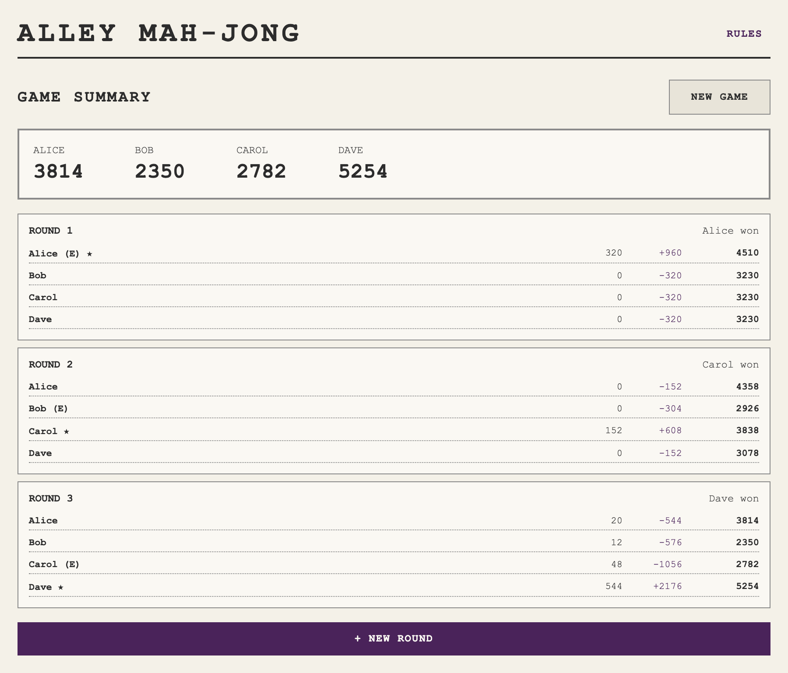
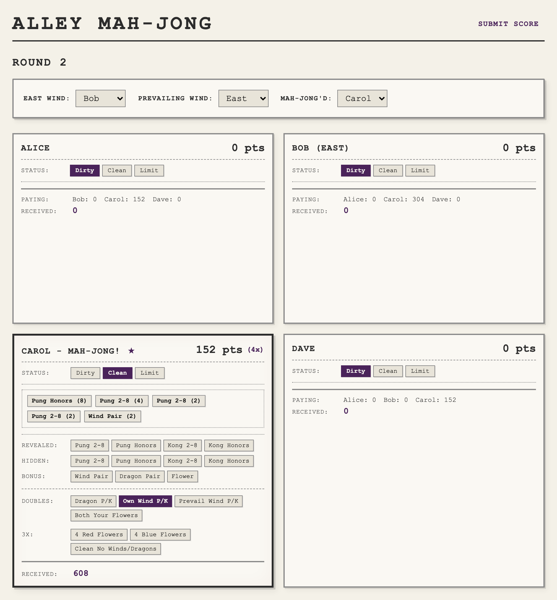

# Alley Mah-jong

Mah-jong scoring app for the Alley family. Available online at [https://raymyers.github.io/alley-mah-jong](https://raymyers.github.io/alley-mah-jong)

Built with [Gleam](https://gleam.run/) and [Lustre](https://lustre.build/).





## Development

```sh
gleam run -m lustre/dev start  # Start dev server with hot reload
gleam test                     # Run tests
gleam build                    # Build the project
```

The dev server will start at http://localhost:1234 by default.

## Testing

Tests include unit tests and a CSV-driven harness for scoring scenarios. Test cases are defined in `test/cases/scoring.csv` using the notation documented in `docs/NOTATION.md`.

## Screenshots

To regenerate the README screenshots:

```sh
npm install --no-save playwright
npx playwright install chromium
node screenshots.mjs
```

This starts the dev server, injects sample game data, and saves screenshots to `assets/`.
